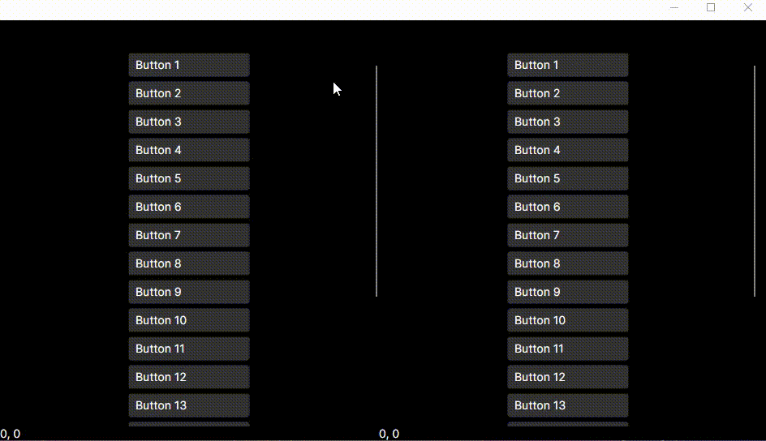

[](https://www.nuget.org/packages/Egolds.Xaml.Behaviors.Interactions.Animated)

# Xaml.Behaviors.Interactions.Animated

**Xaml.Behaviors.Interactions.Animated** is a simple library for Avalonia UI that introduces smooth animation support for vertical scrolling in the `ScrollViewer`. This library adds a smooth scroll effect to improve the user experience, especially for content with a lot of scrolling.



## Installation

You can install `Xaml.Behaviors.Interactions.Animated` via NuGet:

```bash
Install-Package Egolds.Xaml.Behaviors.Interactions.Animated
```

Or, if you prefer, download the `.dll` file directly from the [Releases section of this repository](https://github.com/Egolds/Xaml.Behaviors.Interactions.Animated/releases) and add it to your project references manually.

## Usage

To use `VerticalScrollViewerAnimatedBehavior` in your `.axaml` files, follow these steps:

### Step 1: Add the Namespace

Include the namespace in your `.axaml` file:

```xml
xmlns:ia="using:Xaml.Behaviors.Interactions.Animated"
```

### Step 2: Attach the Behavior

The animation effect is very easy to apply. Simply add `<ia:VerticalScrollViewerAnimatedBehavior/>` to the `Interaction.Behaviors` collection of your ScrollViewer:

```xml
<ScrollViewer Grid.Row="1" VerticalScrollBarVisibility="Auto" HorizontalScrollBarVisibility="Hidden">
  <Interaction.Behaviors>
    <ia:VerticalScrollViewerAnimatedBehavior/>
  </Interaction.Behaviors>

  <!-- Content for scrolling -->
</ScrollViewer>
```

### Step 3: Configure Properties (Optional)

The behavior provides several properties that you can configure to customize the scrolling experience:

#### ScrollStepSize Property

The `ScrollStepSize` property controls the amount of pixels to scroll when using the mouse wheel. By default, it's set to 100 pixels.

```xml
<ScrollViewer Grid.Row="1" VerticalScrollBarVisibility="Auto" HorizontalScrollBarVisibility="Hidden">
  <Interaction.Behaviors>
    <ia:VerticalScrollViewerAnimatedBehavior ScrollStepSize="50"/>
  </Interaction.Behaviors>

  <!-- Content for scrolling -->
</ScrollViewer>
```

- **Default value**: 100 pixels
- **Usage**: Controls the scroll step size when using mouse wheel
- **Effect**: Smaller values create more precise scrolling, larger values create faster scrolling

### License

This project is licensed under the MIT License.
