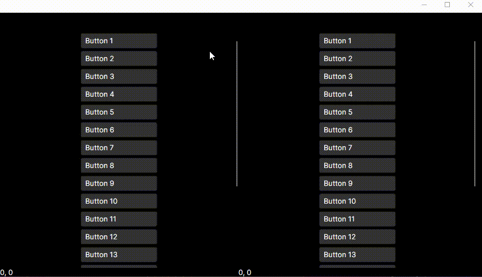

[](https://www.nuget.org/packages/Egolds.Xaml.Behaviors.Interactions.Animated)

# Xaml.Behaviors.Interactions.Animated

**Xaml.Behaviors.Interactions.Animated** is a simple library for Avalonia UI that introduces smooth animation support for vertical and horizontal scrolling in the `ScrollViewer`. This library adds a smooth scroll effect to improve the user experience, especially for content with a lot of scrolling.



## Installation

You can install `Xaml.Behaviors.Interactions.Animated` via NuGet:

```bash
Install-Package Egolds.Xaml.Behaviors.Interactions.Animated
```

Or, if you prefer, download the `.dll` file directly from the [Releases section of this repository](https://github.com/Egolds/Xaml.Behaviors.Interactions.Animated/releases) and add it to your project references manually.

## Behaviors

| Behavior | Reacts to |
| --- | --- |
| `VerticalScrollViewerAnimatedBehavior` | Mouse wheel |
| `HorizontalScrollViewerAnimatedBehavior` | Horizontal wheel and trackpad gestures, `Shift` + mouse wheel, and a plain mouse wheel when nothing around scrolls vertically |

Both behaviors can be attached to the same `ScrollViewer` when its content scrolls in both directions.

## Usage

### Step 1: Add the Namespace

Include the namespace in your `.axaml` file:

```xml
xmlns:ia="using:Xaml.Behaviors.Interactions.Animated"
```

### Step 2: Attach the Behavior

The animation effect is very easy to apply. Simply add `<ia:VerticalScrollViewerAnimatedBehavior/>` to the `Interaction.Behaviors` collection of your ScrollViewer:

```xml
<ScrollViewer Grid.Row="1" VerticalScrollBarVisibility="Auto" HorizontalScrollBarVisibility="Hidden">
  <Interaction.Behaviors>
    <ia:VerticalScrollViewerAnimatedBehavior/>
  </Interaction.Behaviors>

  <!-- Content for scrolling -->
</ScrollViewer>
```

For a horizontally scrolling list, such as a carousel, use `HorizontalScrollViewerAnimatedBehavior` the same way:

```xml
<ScrollViewer Grid.Row="1" HorizontalScrollBarVisibility="Auto" VerticalScrollBarVisibility="Disabled">
  <Interaction.Behaviors>
    <ia:HorizontalScrollViewerAnimatedBehavior/>
  </Interaction.Behaviors>

  <!-- Content for scrolling -->
</ScrollViewer>
```

A plain mouse wheel is picked up automatically, but only when there is nothing vertical around to claim it: neither the list itself nor any list above it scrolls vertically. So a standalone carousel is scrolled with a regular wheel, just like in a browser, while the very same carousel placed inside a scrollable page leaves the wheel to that page and is scrolled with `Shift` + wheel or a trackpad gesture. Unlike a browser, the page keeps the wheel even when it is already scrolled to its end, so a carousel under the pointer never starts moving unexpectedly.

### Step 3: Configure Properties (Optional)

Both behaviors provide the same properties that you can configure to customize the scrolling experience:

#### ScrollStepSize Property

The `ScrollStepSize` property controls the amount of pixels to scroll when using the mouse wheel. By default, it's set to 100 pixels.

```xml
<ScrollViewer Grid.Row="1" VerticalScrollBarVisibility="Auto" HorizontalScrollBarVisibility="Hidden">
  <Interaction.Behaviors>
    <ia:VerticalScrollViewerAnimatedBehavior ScrollStepSize="50"/>
  </Interaction.Behaviors>

  <!-- Content for scrolling -->
</ScrollViewer>
```

- **Default value**: 100 pixels
- **Usage**: Controls the scroll step size when using mouse wheel
- **Effect**: Smaller values create more precise scrolling, larger values create faster scrolling
- **Note**: The value is ignored when the content uses logical scrolling, which defines its own step

#### ScrollChangeSize Property

The `ScrollChangeSize` property controls whether a single wheel notch scrolls by a step or by a whole viewport.

```xml
<ScrollViewer Grid.Row="1" VerticalScrollBarVisibility="Auto" HorizontalScrollBarVisibility="Hidden">
  <Interaction.Behaviors>
    <ia:VerticalScrollViewerAnimatedBehavior ScrollChangeSize="Page"/>
  </Interaction.Behaviors>

  <!-- Content for scrolling -->
</ScrollViewer>
```

- **Default value**: `Line`
- **`Line`**: Scrolls by `ScrollStepSize`
- **`Page`**: Scrolls by the height (or width) of the viewport

## Nested Scroll Viewers

Both behaviors respect the standard `IsScrollChainingEnabled` semantics. A wheel event is consumed by the innermost scroll viewer that can actually move in the requested direction: when it is already at the edge, or cannot scroll along that axis at all, the event is passed to the outer list, so the outer list keeps its own animated scrolling instead of falling back to the built-in one.

Snap points declared by the content, both regular and irregular, are honored, so the animation lands on the same offset the built-in scrolling would land on.

### License

This project is licensed under the MIT License.
